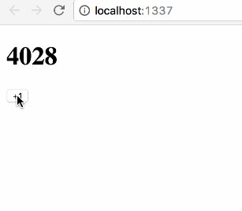

# choo-persist [![stability][0]][1]
[![npm version][2]][3] [![build status][4]][5] [![test coverage][6]][7]
[![downloads][8]][9] [![js-standard-style][10]][11]



Synchronize [choo][choo] state with [indexedDB][mdn]. Does nothing in [browsers
that don't support indexedDB][caniuse].

## Usage
```js
const persist = require('choo-persist')
const choo = require('choo')

const app = choo()

/* register router, views, models */

persist((persist) => {
  app.use(persist)
  const tree = app.start()
  document.body.appendChild(tree)
})
```

## API
### persist(opts?, fn(plugin))
Create a new `indexedDB` database instance, and call the callback with the
plugin when done. Can take an optional first argument of options:
- __opts.name:__ default `'app'`; provide a name for the indexedDB database

### plugin.onStateChange
The plugin should be passed into `app.use()` directly. `onStateChange` listens
for every state change in the application and persists it to `indexedDB`.

### plugin.wrapInitialState
The plugin should be passed into `app.use()` directly. `wrapInitialState`
reads the state from `indexedDB` on start and overrides the initial application
state.

## Installation
```sh
$ npm install choo-persist
```

## FAQ
### Why does this plugin wrap the start() method?
Choo is initialized completely synchronously. This makes it easy to reason
about, implement, and profile. IndexedDB, however, cannot be accessed
synchronously so in order to get the initial state from the DB we must wait for
it to load first. This is why the application start must be wrapped in this
plugin.

### Why not load the default initial state first, and then apply indexedDB?
If the default initial state is loaded from the application before `indexedDB`
kicks in, there will be a flash of unstyled content. It's better to have
generic server side rendering (e.g. can be cached by CDNs) to lower the time to
first rendering, and then load the initial state from the local database after
that to serve the first uncacheable content. This will provide a smooth
experience; and with the addition of a few CSS transitions it might become
impressive even.

## Why would I want to load content from indexedDB?
Because time to first render matters, and connectivity might not always be
great, or available even. By synchronizing the application state with indexedDB
the biggest win for offline has already been achieved: users will be able to
pick up right where they left off; even if internet goes down. From there on
out, caching outgoing HTTP requests and other fancy connectivity tricks could
be applied. Consider this package as an easy way to get a big win for offline
first.

## Should I use this while developing.
No; state is persisted between page reloads which might put your page in very
odd states, with a very annoying way to clear. Consider using hot reloading for
development instead.

## How / when should I invalidate the database cache?
Not sure yet; if you've got good ideas for upgrading / invalidating the local
database I'd love to hear from you; I'm sure people will run into this down the
road anyway.

## Can I use this with something other than choo?
Welp, there's not much code but if it talks the same API then yeah sure you
can. This is a bit specific to choo tho; but there's nothing stopping people
from building their own choo soooo...

## License
[MIT](https://tldrlegal.com/license/mit-license)

[0]: https://img.shields.io/badge/stability-experimental-orange.svg?style=flat-square
[1]: https://nodejs.org/api/documentation.html#documentation_stability_index
[2]: https://img.shields.io/npm/v/choo-persist.svg?style=flat-square
[3]: https://npmjs.org/package/choo-persist
[4]: https://img.shields.io/travis/yoshuawuyts/choo-persist/master.svg?style=flat-square
[5]: https://travis-ci.org/yoshuawuyts/choo-persist
[6]: https://img.shields.io/codecov/c/github/yoshuawuyts/choo-persist/master.svg?style=flat-square
[7]: https://codecov.io/github/yoshuawuyts/choo-persist
[8]: http://img.shields.io/npm/dm/choo-persist.svg?style=flat-square
[9]: https://npmjs.org/package/choo-persist
[10]: https://img.shields.io/badge/code%20style-standard-brightgreen.svg?style=flat-square
[11]: https://github.com/feross/standard
[caniuse]: http://caniuse.com/#feat=indexeddb
[mdn]: https://developer.mozilla.org/en/docs/Web/API/IndexedDB_API
[choo]: https://github.com/yoshuawuyts/choo
